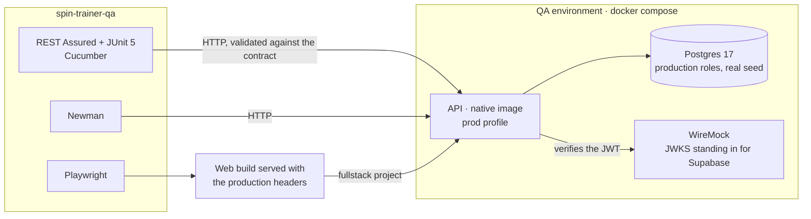

# spin-trainer-qa

Black-box test suite for **Spin Trainer**, a preflop range trainer for Spin & Go poker (3-max and heads-up) that I use
to study and that doubles as my QA portfolio. The suite only talks HTTP to the system: it tests the deployable API image
and the web app as a user and a client see them, independently of their code
([spin-trainer-api](https://github.com/pedromorago/spin-trainer-api),
[spin-trainer-web](https://github.com/pedromorago/spin-trainer-web)).

## At a glance

| Level | Where | Size |
|---|---|---|
| API acceptance (REST Assured + JUnit 5) | this repo | 145 tests, every response validated against the OpenAPI contract |
| Executable specification (Cucumber, in Spanish) | this repo | 23 scenarios in 4 features |
| Collection regression (Newman) | this repo | 20 requests, 47 assertions |
| E2E (Playwright + TypeScript, axe) | this repo | 95 tests against the mock and 93 against the real API (the same specs), 6 against the public demo, under the production CSP |
| API unit and integration | spin-trainer-api | 152 unit tests (PIT mutation score 100 %) and 106 integration tests (Testcontainers) |
| Web unit | spin-trainer-web | 347 Vitest tests (Stryker mutation score 100 % in the domain) |

## What the tests found

Each of these was a real defect or gap, found by a test before it reached anyone, and each test stays as a regression.

| Finding | Found by | Fixed in |
|---|---|---|
| The Explorer's Reset (a `DELETE`) returned 406 against the real API and passed against the mock | E2E, `fullstack` project | API and web |
| With the JWT issuer down, the API answered a correct 503 that the contract did not declare | `IssuerOutageTest` | contract |
| A tab whose code failed to download (e.g. after a deploy) showed React Router's debug screen, in English, with no way out | fault injection, `resilience.spec.ts` | web |
| In the native image, every 400 with field errors became a 500 (a reflection hint Spring AOT could not infer) | this suite, run against the deployable image | API |
| Missing boundary values, and a test named "exactly full last page" that never filled a page | mutation testing (PIT, Stryker) | tests in API and web |
| A range deleted and created again restarted at version 1, so a stale tab could overwrite it silently | review, now `UserRangeLifecycleTest` | API (migration V6) |
| The API suite could pass from Gradle's cache without talking to the current API | review | this suite's build |
| HU SB Open's tenth action had no working keyboard shortcut; the next player on a tab inherited the previous one's data | review, now `quiz.spec.ts` and `auth.spec.ts` | web |
| On the landing page, a signed-in visitor's "Try a hand" dealt a new hand under them once their session was read | E2E, `fullstack` project (`landing.spec.ts`) | web |
| A tooltip opened by a click's focus covered the Builder's grid; the sticky header's labels lost contrast over the grid | axe, `accessibility.spec.ts` and `onboarding.spec.ts` | web |
| Signing in from the landing page's dialog left the player on the landing instead of where the link pointed | E2E, `mock` project (`sign-in.spec.ts`) | web |
| On a phone, changing the chart showed the grid oversized for a frame | by hand on a phone, now `responsive.spec.ts` (frame by frame) | web |
| On a slow network, a quick click on Start training skipped the sign-in dialog | by hand on the live site, now `sign-in.spec.ts` (a held-back chunk plays the slow network) | web |

## How it is tested

- **Test design, explicit per test**: equivalence partitioning, boundary value analysis, decision tables, state
  transitions, randomized testing against an oracle, seeded generated data and a lost-update concurrency test.
- **Contract**: every response is validated against a pinned copy of `openapi.yaml` (status,
  Content-Type, schema and formats); errors are Problem Details checked by type, status, title and detail template.
- **Real system**: the API's production image (a GraalVM native executable), Postgres with the production roles and a
  WireMock issuer for the JWTs; the reference data is the real seed, the 80 example ranges (ADR-0024).
- **Non-functional, without extra tools**: accessibility with axe (WCAG 2.2 AA) on every page, security headers, the
  production Content-Security-Policy, and fault injection (a chunk that fails to download, a server waking up).
- **Traceability** from each rule and decision (ADR) to the tests that check it, and a combined Allure report.

The full picture, with the test basis, oracles and traceability: [`docs/TEST_STRATEGY.md`](docs/TEST_STRATEGY.md).
The decisions behind the project: [ADRs](https://github.com/pedromorago/spin-trainer-web/tree/main/docs/adr).

## System under test



## Where to start reading

- [`docs/TEST_STRATEGY.md`](docs/TEST_STRATEGY.md): levels, techniques, oracles, traceability and findings.
- `api-tests/src/test/java/.../quiz/QuizGradingTest.java`: a decision table and randomized testing against the
  reference ranges.
- `api-tests/src/test/java/.../ranges/UserRangeLifecycleTest.java`: state transitions and the lost-update test.
- `api-tests/src/test/resources/features/rango_personalizado.feature`: the business rules in the player's language.
- `api-tests/src/main/java/.../contract/`: how every response is validated against the contract.
- `e2e/tests/resilience.spec.ts` and `e2e/tests/server-wake.spec.ts`: fault injection in the browser.

## Requirements

- Docker (Docker Desktop with WSL 2 on Windows) and JDK 21 (Gradle downloads it if missing). The API image is a native
  executable (ADR-0018): its first build takes about four minutes and needs Docker Desktop to have at least 8 GB;
  `QA_BUILD_API=false` reuses the last one.
- Node LTS (22.13+) for Newman and Playwright: `npm install` once, here and in `spin-trainer-web`, and
  `npx playwright install chromium`.
- The three repos as siblings in the same folder (`spin-trainer-api`, `spin-trainer-qa`, `spin-trainer-web`):
  the environment builds the API from its repo and the E2E tests build the web app from its own.

## Running

| Windows | Linux/macOS | What it does |
|---|---|---|
| `.\gradlew.bat :api-tests:test` | `./gradlew :api-tests:test` | Starts the environment (Testcontainers + docker compose), runs the API tests (JUnit and Cucumber) and stops it |
| `.\gradlew.bat :api-tests:test -Ptags=smoke` | `./gradlew :api-tests:test -Ptags=smoke` | Smoke tests only |
| `npm run env:up` / `env:down` | same | Starts / tears down the environment manually |
| `npm run newman` | same | Newman collection against the running environment (`QA_API_URL` for a different one) |
| `npm run e2e` | same | Playwright: `mock` project (no backend), `fullstack` (requires `npm run env:up`) and `demo` |
| `npm run e2e:mock` / `e2e:fullstack` / `e2e:demo` | same | One of the projects |
| `npm run report` / `report:open` | same | Combined Allure report (API, Newman and E2E) in `build/allure-report` / open it |
| `.\gradlew.bat specCheck` / `specSync` | `./gradlew specCheck` / `specSync` | Checks / pulls the contract from `../spin-trainer-api/openapi.yaml` |
| `.\gradlew.bat rangesCheck` / `rangesSync` | `./gradlew rangesCheck` / `rangesSync` | Checks / pulls the reference ranges from `../spin-trainer-api/reference-ranges.json` |

Manual environment (for debugging or for Newman/Playwright): `npm run env:up`. If it is already running, the Gradle
tests reuse it and leave it running.

Cucumber scenario names contain accented characters: with a POSIX locale (Linux without `LANG`), Gradle's HTML report
fails to write them; setting `LANG=C.UTF-8` is enough. Nothing is needed on Windows or GitHub Actions.

## QA environment (`env/`)

| Service | Port | What it is |
|---|---|---|
| `api` | 8081 | The API built from `../spin-trainer-api` (`prod` profile, JSON logs) |
| `postgres` | 55432 | Postgres 17 prepared with the API's `bootstrap.sql` (roles `spin_migrator` and `spin_app`) |
| `jwks` | 8089 | WireMock standing in for Supabase Auth: serves the JWKS of the QA key (`env/jwt`) and accepts logout |

Reference data: the real data, from the API seed (V9, the 80 example ranges of ADR-0024), with a single QA adjustment in
`env/flyway/R__qa_fixtures.sql`: btn_open@8 is left without a range so that the suite can verify, black-box, that
without a range there is no grading (422). The oracles read the pinned copy `contract/reference-ranges.json`. Each test
uses new users: no data cleanup is needed.

## Configuration

| Variable / `-Pqa.*` | Default | Purpose |
|---|---|---|
| `QA_API_URL` / `qa.apiUrl` | `http://localhost:8081/api/v1` (managed environment) | An already deployed API: the suite starts nothing |
| `QA_BUILD_API` / `qa.buildApi` | `true` | `false` reuses the latest API image instead of rebuilding it |
| `QA_AUTH` / `qa.auth` | `local` | Token provider (`TokenProviders`); `local` signs with the QA key |
| `QA_JWT_ISSUER` / `qa.jwtIssuer` | `http://jwks:8080/auth/v1` | Issuer the API expects |

## Structure

```
contract/                 pinned copies of the contract and the reference ranges (specCheck/specSync, rangesCheck/rangesSync)
env/                      system under test: docker-compose, Postgres bootstrap, WireMock, QA key, data
api-tests/src/main        framework: config, environment, tokens, client (ServiceBase + one service per tag),
                          validation against the contract, ErrorType + ProblemAssert, test data
api-tests/src/test        suites per module (situations, ranges, quiz, stats, security, HTTP) and Cucumber steps (bdd)
api-tests/src/test/resources/features   business rules in Gherkin, in Spanish
newman/                   Postman collection (a player's full flow) and QA environment
e2e/                      Playwright (TypeScript): fixtures, Page Objects, reference data and specs
.github/workflows/qa.yml  CI: environment, API, Newman, E2E and combined Allure report
scripts/                  Newman runner, QA token (lib/qa-jwt.mjs), key generation and the E2E web server (serve-web.mjs)
docs/TEST_STRATEGY.md     strategy, techniques and traceability
```

## E2E (`e2e/`)

The same specs run against two backends, and a third project tests the public demo (ADR-0022):

| Project | Web | Backend | Session |
|---|---|---|---|
| `mock` | `build:mock` served on 4173 | the web app's in-memory adapter | the mock's own (always signed in) |
| `fullstack` | http-mode build served on 4174 | the QA environment's API | QA JWT injected as the Supabase session |
| `demo` | `build:demo` served on 4175, only `demo.spec.ts` | the in-memory adapter | none: the demo has no sign-in |

Every test starts as a returning visitor (the `onboarded` fixture marks the first-visit tour as seen), so the tour does
not cover the page; `onboarding.spec.ts` asks for a first visit with `test.use({ onboarded: false })`.

The reference data is the same in both (the API seed; the web mock keeps the same copy), and so are the oracles. Each
test uses a new player and fails on console errors, exceptions or unexpected HTTP responses ≥ 400. Accessibility is
checked with axe (WCAG 2.2 AA) on every page. Playwright HTML report in `build/e2e/report`.

## CI (`.github/workflows/qa.yml`)

On every push to `main`, on every PR, on demand and every Monday: clones the API and web repos next to this one (the
same branch if it exists, otherwise `main`), starts the environment, runs the API, Newman and E2E suites even if one of
them fails, and publishes the combined Allure report, the Playwright report, the Newman reports and the environment logs
as the `qa-reports` artifact.

From `main`, the Allure report can also be published on GitHub Pages: make the repo public, set **Settings → Pages →
Source** to GitHub Actions and create the `PUBLISH_REPORTS` repository variable with the value `true`.

The repos are private: the workflow needs the `SPIN_TRAINER_REPOS_TOKEN` secret, a read-only *fine-grained* token
(Contents: read) on `spin-trainer-api` and `spin-trainer-web`. If the repos become public, it is no longer needed.
